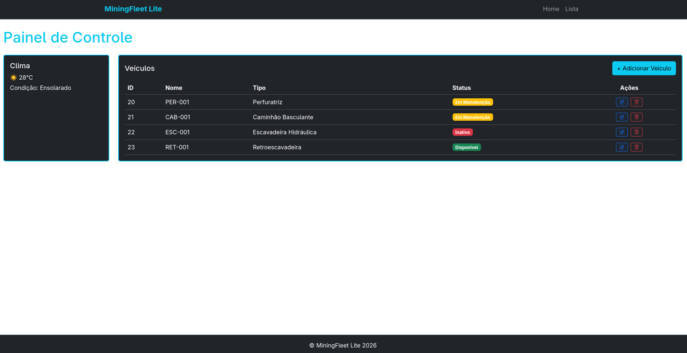
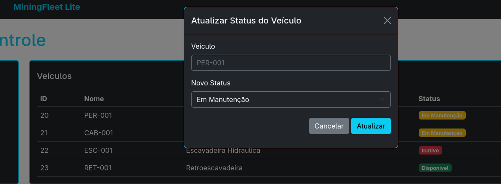
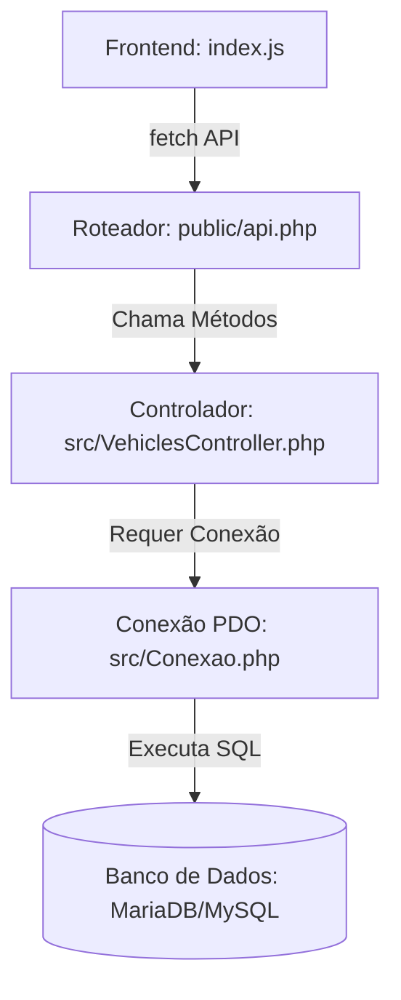

# MiningFleet Lite 🚜

Sistema simplificado de gerenciamento de frotas para operações de mineração.

## 📸 Imagens do Projeto

Aqui estão capturas de tela do sistema em funcionamento:

### Dashboard Principal



### Modal de Atualização de Veículo



---

## 🛠️ Como Executar no Fedora OS

Siga os passos abaixo para configurar e executar o projeto em seu Fedora OS:

### 1. Instalar as Dependências (PHP e MariaDB/MySQL)

Abra o terminal e execute os seguintes comandos para instalar o PHP, as extensões necessárias do PDO e o servidor de banco de dados MariaDB:

```bash
sudo dnf update
sudo dnf install php php-mysqlnd php-pdo php-json
sudo dnf install mariadb-server
```

### 2. Iniciar e Configurar o Banco de Dados

Inicie e habilite o serviço do MariaDB:

```bash
sudo systemctl enable --now mariadb
```

Para configurar a segurança básica do MariaDB (opcional):

```bash
sudo mysql_secure_installation
```

Em seguida, crie o banco de dados e a tabela importando o script SQL fornecido:

```bash
mysql -u root -p < schema/gestao_frota_v1.sql
```

### 3. Configurar as Variáveis de Ambiente

Crie o arquivo `.env` na raiz do projeto copiando o exemplo:

```bash
cp .env.example .env
```

Edite o arquivo `.env` com os dados de conexão do seu banco de dados local.

### 4. Executar o Servidor Embutido do PHP

Inicie o servidor local apontando para a pasta pública `public/`:

```bash
php -S localhost:8000 -t public
```

Abra o seu navegador e acesse `http://localhost:8000` para visualizar o projeto.

---

## 🏗️ Arquitetura do Projeto e Fluxo de Dados

A arquitetura do projeto separa a lógica de negócios da interface do usuário de forma segura. O fluxo de dados opera da seguinte maneira:

1. **Interface do Usuário (Frontend)**:
   - O painel principal está no arquivo [public/index.php](/public/index.php).
   - As ações e o carregamento assíncrono dos dados são orquestrados em JavaScript pelo arquivo [public/scripts/index.js](/public/scripts/index.js) utilizando requisições `fetch` nativas.
2. **Roteamento de API (`public/api.php`)**:
   - Todas as requisições assíncronas do frontend chegam em [public/api.php](/public/api.php). Ele analisa o método HTTP (GET, POST, PATCH, DELETE) e direciona as chamadas.
3. **Controlador (`src/VehiclesController.php`)**:
   - O arquivo [public/api.php](public/api.php) aciona o [VehiclesController](/src/VehiclesController.php) para executar a lógica de negócios correspondente.
4. **Persistência (`src/Conexao.php`)**:
   - O [VehiclesController](/src/VehiclesController.php) carrega a conexão do banco de dados instanciada pelo arquivo [src/Conexao.php](/src/Conexao.php). Esta classe lê de forma segura o arquivo `.env` e utiliza o PDO com prepared statements para fazer o envio e recebimento dos dados da tabela no MySQL/MariaDB de forma protegida contra SQL Injection.



---

## 🚀 Melhorias Futuras

- **Responsividade para Celular**: Otimizar o layout Bootstrap para garantir que o painel e os formulários de cadastro e edição se adaptem adequadamente a dispositivos móveis.
- **Integração com API de Clima**: Substituir a seção estática de clima por uma integração de tempo real usando `fetch` com serviços externos de previsão do tempo, filtrando as coordenadas geográficas de Lavras/MG.
